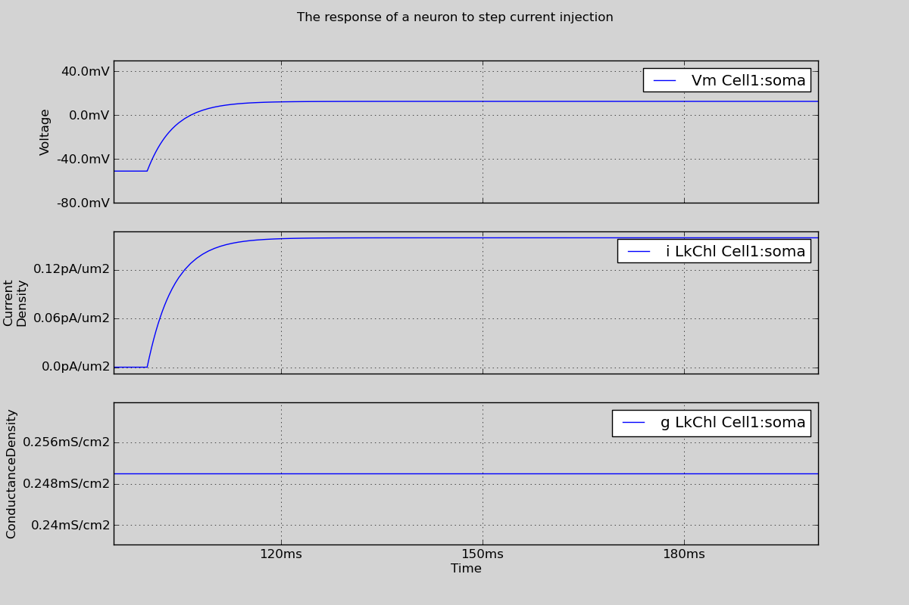

Simulation Layer
====================

.. comment sdfsadf fasdf
    .. |MHThesis| replace:: :download:`Mike Hull's Ph.D Thesis </static/MHThesis.pdf>`

.. |Morphology| replace:: :class:`Morphology <morphforge.morphology.core.MorphologyTree>`

.. |Cell| replace:: :class:`Cell <morphforge.simulation.base.core.cell.Cell>`
.. |Cells| replace:: :class:`Cells <morphforge.simulation.base.core.cell.Cell>`
.. |CellLocation| replace:: :class:`CellLocation <morphforge.simulation.base.core.celllocation.CellLocation>`

.. |Simulation| replace:: :class:`Simulation <morphforge.simulation.base.core.simulation.Simulation>`
.. |SimulationResult| replace:: :class:`SimulationResult <morphforge.simulation.base.result.simulationresult.SimulationResult>`
.. |Channel| replace:: :class:`Channel <morphforge.simulation.base.biophysics.channel.Channel>`
.. |Channels| replace:: :class:`Channels <morphforge.simulation.base.biophysics.channel.Channel>`
.. |Environment| replace:: :class:`Environment <morphforge.simulation.base.core.simulationenvironment.SimulationEnvironment>`

.. |NEURONCell| replace:: :class:`NEURONCell <morphforge.simulation.neuron.objects.obj_cell.NEURONCell>`
.. |NEURONChannel| replace:: :class:`NEURONChannel <morphforge.simulation.neuron.biophysics.mm_neuron.NEURONChl_Base>`

Overview
~~~~~~~~
The simulation layer provides an object model for building simulations of multicom
partmental neurons and networks entirely within Python. The object-model in the
simulator layer is designed to be both flexible and allow complex simulations to be written concisely. A script to run a simulation normally performs the following steps:

  a. Choose an |Environment| & instantiate a |Simulation|
  b. Define types of |Channel| and Synapses
  c. Populate the |Simulation| with |Cells|
  d. Specify the biophysics of the |Cells|, (e. g. applying |Channels|, setting passive properties)
  e. Connect the |Cells| with Synapses
  f. Specify experimental stimuli ( e. g. CurrentClamp) )
  g. Define which values should be recorded during the simulation
  h. Call |Simulation|.run(), which runs the simulation and returns a |SimulationResult| object
  i. Retrieve the recorded values from the SimulationResult for plotting or analysis

A simple example script is given below that simulates a single neuron with passive channels in response to a step current injection. No external file dependencies are needed, and running the code will cause the figure shown below to be displayed on the screen. The objects involved in these steps are described in more detail below.

.. literalinclude:: /srcs_generated_examples/python_srcs/singlecell_simulation010.py

Environments & Simulations
~~~~~~~~~~~~~~~~~~~~~~~~~~
|Environment| and |Simulation| object are central objects in building simulations, but in most cases, they should be simple to use. Briefly |Environment| objects are factories for producing objects in a simulation for particular  backends. This allows a clear separation between abstract concepts, such as |Cell| and |Channel|, and the particular NEURON implementation code (e.g. |NEURONCell| and |NEURONChannel|). |Simulation| objects can be created from |Environment| objects, and encapsulate an entire simulation. This allows multiple simulations to be created within a single script unambiguously, for example to run parameter-sweeps ( e.g. :ref:`example_singlecell_simulation020` ), or to investigate how stochastic variation in parameters affects the results of simulations.

.. seealso::

    |MHThesis|
        * Appendix D (Pg. 215)
        
        

Cells
~~~~~

|Cell| objects in morphforge represent neurons. A |Cell| object has an associated |Morphology|, and also contains information about the channels and associated parameters applied to that neuron, as well as information about segmentation of the morphology for better spatial accuracy during simulation (see :ref:`segmentation`). 

Channels
~~~~~~~~

Several specialist file formats already exist for defining membrane channel and synaptic dynamics and parameters in simulators, for example MODL, NeuroML, NineML, or neurounit, and we would also like to be able to define channels and synapses in code directly. Rather than choose a single format for specifying primitive dynamics, morphforge uses Python’s dynamic typing to support a flexible model for membrane channels and synapses. We begin by discussing channel models.
Morphforge is agnostic about the underlying format of channel models. We assume that an abstract channel can have a series of parameters, that can change in different areas of the membrane, and there is a set of default values for these parameters. To integrate with the morphforge framework, |Channel| objects are expected to provide a particular interface, some methods of which are general and some of which are simulator-backend specific. All |Channel| objects must implement the methods get_variables() & get_defaults() which return a list of parameter names for that |Channel|, (for example: [’g_bar’,’erev’]) and their default values respectively. These are used by the channel-distribution infrastructure in morphforge when calculating the parameter values which should be applied to each compartment of a
Cell. Additionally, when the NEURON-backend is used, |Channel| objects must also implement the methods create_modfile() and build_hoc_section(), which build the MODL code and insert the relevant code into the HOC file.

As with the simulation objects, this is achieved by inheritance. For example, NeuroMLChl represents NeuroML channel loaded from an XML file, and is subclassed to produce the NEURON- specific NEURONNeuroMLChl. NeuroMLChl, implements the methods get_variables() and get_defaults(), which return the names of parameters that can be varied over the neuron, (for example g_bar) and their default values which are found by parsing the XML file. NEURONNeuroMLChl implements the methods create_modfile(), which returns a string of MODL code for the NeuroML file (for example generated using an XSLT ) and build_hoc_section(), which returns the relevant HOC statements for inserting the |Channel| into a Section with a particular set of parameter values.

.. seealso::

    :ref:`Channel-types defined by morphforge-contrib <section_mfchanneltypes>`
        Several |Channel|-types are provided by the morphforge-contrib package, including Hodgkin-Huxley, MODL, NeuroML and NeuroUnit-type channels.

    Examples scripts:

        * :ref:`example_singlecell_simulation020`
        * :ref:`example_singlecell_simulation050`
        * :ref:`example_assorted_10compareHHChls`
        * :ref:`example_poster1`

    |MHThesis|
       * Appendix D (Pg. 217)

Biophysics - MTA
------------------
We now discuss how |Channels| are applied to a neuron’s membrane. In many
neurons it is known that the distribution density of a particular channel type over the membrane is not uniform. Often in models, we want to incorporate this, and specify that a |Channel| exists all over particular regions of the neuron, and use specific parameters in specific regions. For example, the conductance density of potassium channels might be 30 mS/cm2 all over on a model neuron’s membrane, except in apical dendrites where it is 50 mS/cm2 . Existing models have used even more complex channel distribution schemes, for example that the density of sodium channels on the initial segment of the axon should vary as the function of distance from the soma [Schmidt-Hieber et al., 2008]. Morphforge supports complex specifications of channel densities over neurons using a high-level notation. This is achieved by passing a triplet of objects to the apply_channel method of |Cell| objects: (Channel, Applicator,Targeter). The Targeter object defines which Sections in the |Cell| this triplet applies to (i. e. a predicate object). The Applicator object defines how the parameters of the |Channel| should vary over the specified Sections. Listing D.7 shows an example in which twice the density of potassium channels are applied in the “dendrites” as the rest of the |Cell|. In this example, we use two Targeters: TargetEverywhere and TargetRegion, and one Applicator: ApplyUniform. A |Channel| object has an associated set of default parameters (e. g. gbar, see Section D.1.1), which are used by default by ApplyUniform (e. g. Listing D.7 line 2), although they can be overridden or scaled (e. g. Listing D.7 line 3).

.. code-block:: python

        # Apply more potassium in the dendrites:
        cell.apply_channel(k_chl, TargetEverywhere(), ApplyUniform() )
        cell.apply_channel(k_chl, TargetRegion(’dendrites’), ApplyUniform(multiply_parameters={’gbar’:2.0}) )

The apply_channel method can be called many times for the same |Channel| on the same |Cell|, with different Targeters and Applicators. However, in the simulation, a particular |Channel| will only be applied once to any given Section. If multiple Targeters affect the same Section, a system is needed to resolve which parameter values to use. For example, in Listing D.7, which value of gbar should be applied to the dendrites — should it be the default (since the “dendrites” region will be targeted by TargetEverywhere), or should twice the default (since the “dendrites” region will also be targeted by TargetRegion)?

To resolve these conflicts, each Targeter object has a priority level associated with it. For example TargeterEverywhere has a priority of 10, and TargeterRegion has a priority of 20. When Simulation.run() is called, for every |Channel| applied to every Section, morphforge finds the corresponding targeter with the highest priority.

.. seealso::

    Examples scripts:
    
        * :ref:`example_singlecell_simulation080`
        
    |MHThesis|
       * Appendix D.2 (Pg. 225; 236)

.. _segmentation:

Segmentation
~~~~~~~~~~~~~

.. todo::

    A brief overview of segmentation objects

.. seealso::

    Examples scripts:
    
        * :ref:`example_singlecell_simulation090`
        
    |MHThesis|
       * Appendix D.2 (Pg. 222)
       

Stimuli
~~~~~~~~

.. todo::

    A brief overview of cell objects

.. seealso::

    Examples scripts:
    
        * :ref:`example_singlecell_simulation100`
        
    
    
    

Recording
~~~~~~~~~~

We need to record various values during a simulation, for example voltages and currents. The morphforge object-model agnostic to the underlying formats of particular synapse and channel formats and supports the recording of any values from any |Channel|, Synapse or other objects through a consistent interface using the method Simulation.record(), as shown in Listing D.9. Internally, record(obj,...) forwards calls to obj.get_recordable(...), which provides a flexible, yet consistent interface to recording what could be specific
data from simulation objects (for example the voltage-dependence term of an NMDA synapse).

.. code-block:: python

        env = NEURONEnvironment()
        sim = env.Simulation()

        # Create a passive cell:
        cell = CellLibrary.create_cell(sim, StandardModels.SingleCompartmentPassive, area=qty(’1000:um2’), input_resistance=qty(’300:MOhm’))

        # Add active channels (using ComponentLibraries):
        chl = ChannelLibrary.get_channel( modelsrc = StandardModels.HH52, channeltype="Na", env=sim.environment)
        cell.apply_channel(chl)
        cc = current_clamp = sim.create_currentclamp(amp=qty(’100:pA’), dur=qty(’100:ms’), delay=qty(’100:ms’), cell_location = cell.soma)

        # Record:
        sim.record(cell, what=’Voltage’, name=’V’, cell_location=cell.soma)
        sim.record(chl, what=’StateVariable’, state=’m’, cell_location=cell.soma)
        sim.record(cc, what=’Current’)

A set of standard strings, such as Voltage, Current and StateVariable are defined in morphforge, which are used in the method calls on lines [14-16] in order to specify what to record. The use of strings allows loose coupling across this interface and allows arbitrary variables to be recorded. sim.record() can take a variety of parameters, depending on the particular object being recorded from. In order to provide a clean architecture behind the scenes, another object called Recordable is introduced (Fig. D.5). Following a call to record(obj,...), the method get_recordable() of obj is called which returns a Recordable object. This contains the relevant machinery to record a particular value from obj using a particular simulator-backend. The get_recordable() method must internally determine which
type of Recordable object to return, depending on the parameters passed. As a more concrete example, if the NEURON simulator backend is being used and if get_recordable() is called on a NeuroML channel to record the conductance density at a specific neuron
location, then a Recordable object is returned that knows the name of the conductance variable in the generated MODL file (see Section D.1.1), and is able to insert suitable statements into the HOC script to record and return this conductance after the simulation.

A Recordable object can have a name (e. g. Listing D.9 line 14), which can be used to access the corresponding Trace object after the simulation has been run (see next sec- tion). A Recordable object can also take a set of additional user-defined tags, which will be attached to the Trace object (see Section D.1.2). The units of the recordings are automatically handled, for example, when the user requests the Trace object corresponding to the record() statement on line 14 of Listing D.9, it will automatically have the units of millivolts.

.. seealso::

    Examples scripts:
    
        * :ref:`example_singlecell_simulation080`
        

Synapses
~~~~~~~~
In morphforge, as in NEURON [Carnevale and Hines, 2006], a Synapse is built from a pair of Presynaptic and Postsynaptic objects (Fig. D.2). Presynaptic objects generate events, for example from a list of times or in response to the voltage of a presynaptic neuron crossing a threshold (Fig. D.2). PostSynaptic objects represent synaptic receptors in the postsynaptic neuron, which open and close with particular dynamics and change the membrane conductance. PostSynaptic consume events to produce discrete changes in the receptor state. Using this scheme allows the presynaptic and postsynaptic components of the synapse to be uncoupled; a particular postsynaptic receptor can be modelled and it is simple to change to the source of spike timing. Another advantage of this scheme is that if the model of the postsynaptic receptors are linearly superposable, then it is possible to replace multiple, identical postsynaptic receptors on a single neuron with a single instance which is driven by multiple event sources, which can dramatically reduce the number of equations that need to be solved by the simulator.

Chemical Synapses & Templates
-----------------------------

Different forms of equations and description languages have already been used to describe postsynaptic receptor dynamics. As with the definition of |Channel| objects (Section D.1.1), morphforge does not require a particular format, but expects that any PostSynaptic objects conform to a particular, backend-specific, interface. As Although morphforge is not designed with efficiency as the first priority, efficiency must be considered with Synapse objects. Even in networks with a relatively small number of neurons, the number of synapses between them can quickly become very large. A recent model of the tadpole spinal cord has only 840 neurons, but approximately 180,000 synaptic connections [Borisyuk et al., 2008]. It is important to be able to specify large numbers of synapses, with variation in the parameters, which can be translated to efficient simulator-specific code.

Morphforge takes an explicit approach to constructing multiple synapses of the same type by using the flyweight-pattern [Gamma et al., 1994]. This involves another factory class, PostSynapticTemplate, which has a method, instantiate(), which returns a new PostSynapticObject. This object delegates its backend-specific methods (e. g. create_modfile()) back to the parent PostSynapticTemplate object, to allow efficient code-generation. Since the instantiate() method can take parameters, it is possible to incorporate variation into the parameters of individual synapses. An example of using postsynaptic templates with NeuroUnits is given below.

.. code-block:: python

        synapse_def = """
        define_component syn_alpha {
            g’ = -g/{2ms}
            g2’ = -g2/{10ms}
            i = (g-g2) * (v-{0mV})
            gInc = 5pS
            <=> INPUT v: mV METADATA {"mf":{"role":"MEMBRANEVOLTAGE"} }
            <=> OUTPUT i:(mA) METADATA {"mf":{"role":"TRANSMEMBRANECURRENT"} }
            on on_event(){
                g = g + gInc
                g2 = g2 + gInc
                }
        }
        """
        cell1 = sim.create_cell(...)
        cell2 = sim.create_cell(...)
        cell3 = sim.create_cell(...)
        
        syn_tmpl = env.PostSynapticMechanismTemplate(NeuroUnitsTemplate, synapse_def)
        sim.create_synapse(
            trigger = VoltageThresholdTrigger(cell_location = cell1.soma, v=0*mV),
            post_synaptic = env.PostSynaptic(NeuroUnitSynapse, synapse_def, cell_location=cell2.soma )
        )
        sim.create_synapse(
            trigger=VoltageThresholdTrigger(cell_location = cell1.soma, v=0*mV),
            post_synaptic = env.PostSynaptic(NeuroUnitSynapse, synapse_def, cell_location=cell3.soma )
        )

.. seealso::

    Examples scripts:
    
        * :ref:`example_multicell_simulation010`
        * :ref:`example_poster2`

    |MHThesis|
       * (???!)
       

Electrical Synapses
-------------------

.. seealso::

    Examples scripts:
    
        * :ref:`example_multicell_simulation020`

    |MHThesis|
       * (???!)

NeuronPopulations and SynapticPopulations
-----------------------------------------

SimulationResult objects
------------------------

